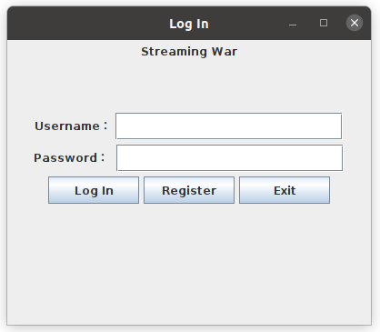
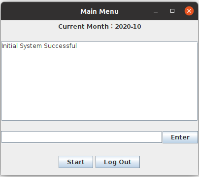

# Streaming Wars Project
This is a single-user **Steaming Wars Project** system with the purpose of simulates the interatctions between various demographic groups and streaming services.

**Author**: <Team 78\>

- Caroline Zhang 
- Zhang L.
- Yuan C.

## Running Environment

OS: Windows, Mac OS, Ubuntu

JDK: JAVA 11 JDK

Instruction:

1. Open Terminal (Command Prompt of Windows)
2. Change disk to the root directory of the project (example: .../6310SAD-group78)
3. Input "java -jar StreamingWars_team78.jar" in terminal to execute the jar file
4. It is ready to go

## Snapshot
Below are two windows a user will be able to see while using this system:

## 1. Login Menu Instruction

Only registed user could access the system and to execute required command line

Instruction

1. Type in Username (sample account: "jimmy")
1. Type in Password (samplt account: "6310ta")
1. Click "Login" button if the username & password has been registed in the system
1. Click "Register" button if user want register the input username and password in system
1. Click "Exit" to exit the system and close the window

## 2. Main Menu Instruction

After system pass the account checking process, it will automaticlly jump to Main Menu window. User could type command code to execute required program in system. 

Supported command:

- create_demo,< short name >,< long name >,< number of accounts >;
- create_studio,< short name >,< long name >;
- create_event,< type >,< name >,< year produced >,< duration >,< studio >,< license fee >
- create_stream,< short name >,< long name >,< subscription price >
- offer_movie,< streaming service >,< movie name >,< year produced >
- offer_ppv,< streaming service >,< pay-per-view name >,< year produced >,< viewing price >
- watch_event,< demographic group >,< percentage >,< streaming service >,< event name >,< year produced >
- display_demo,< short name >
- display_stream,< short name >
- display_studio,< short name >
- display_events
- display_offers
- display_time
- next_month
- update_demo,< short name >,< number of accounts >;
- update_event,< name >,< year produced >,< license fee >;
- update_stream,< short name >,< subscription price >;
- retract_movie,< streaming service >,< movie name >,< movie year >;
- clear_all; [Clean all the record in system except user information]
- refresh; [Refresh and clean the screen]
- test busy; [Start an infinite looping program to test system's performance in busy]
- test confirmation; [Start an  program to test system's performance in repeatly sending command into system but system is in busy, until time out]

Instruction

1. Type command code in "commanding input textfield"
2. Click "Enter" to execute the command code
3. Click "Start" button to automaticlly insert some pre-typed data into system
4. Click the "X" on the top right corner to exit the system

### Start Button

Start button can automatically execute some prepaird command into system to generate some records for test. Followed is the preparid command:

**studio(4)**

* create_studio,warner,Warner Brothers
* create_studio,columbia,Columbia Pictures
* create_studio,20cent,20th Century Fox
* create_studio,espn,Entertainment Sports Network

**Event(9)**

* create_event,movie,Batman Begins,2005,140,warner,1000"
* create_event,movie,Tenet,2020,150,warner,4000"
* create_event,movie,Wonder Woman,2017,114,warner,2000"
* create_event,movie,Hollow Man,2000,112,columbia,1000"
* create_event,movie,The Grudge,2004,91,columbia,1000"
* create_event,movie,The New Mutants,2020,94,20cent,3000"
* create_event,ppv,Justice League Live,2020,180,warner,12000"
* create_event,ppv,World Blitz Championship,2020,180,espn,3000"
* create_event,ppv,EuroCup Football,2020,120,espn,5000"

**Streaming Service(3)**

* create_stream,net,Netflix,12"
* create_stream,apv,Amazon Prime Video,15"
* create_stream,hulu,Hulu Plus,11"

**Demographic Group(3)**

* create_demo,age_40_50,Viewers between 40 and 50,800"
* create_demo,age_20_heroes,Viewers of Marvel/DC under 20,10000"
* create_demo,sci_fi,Viewers of Science Fiction,2000"

